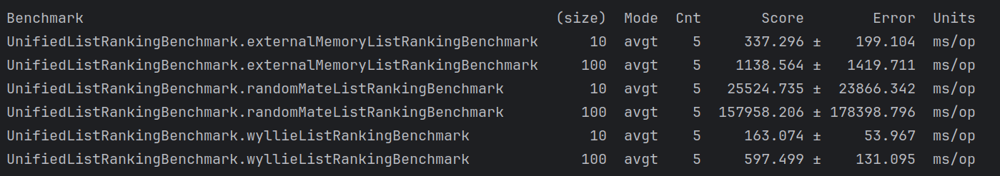
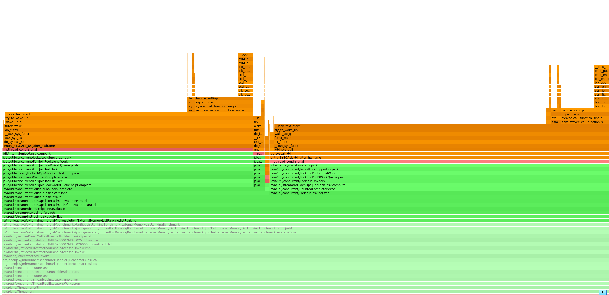
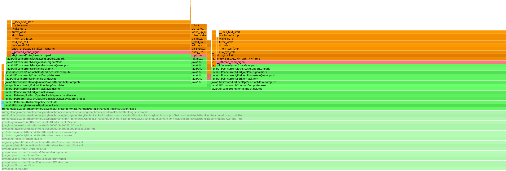
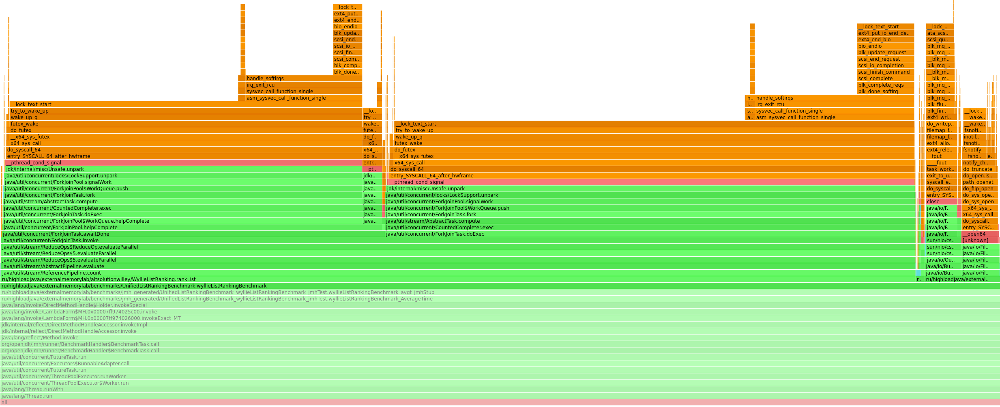
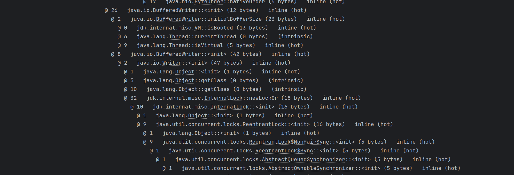
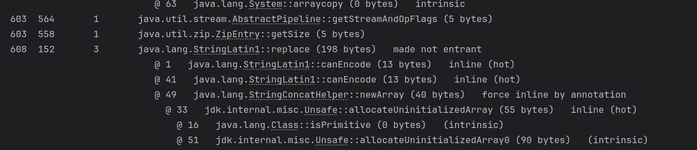
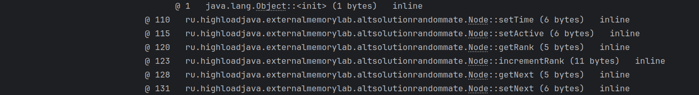
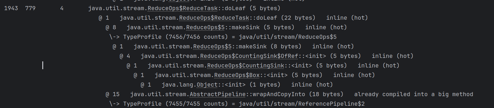

# Lab2 External Data Algorithms

В качестве задания была выбрана задача ListRanking 
(Необходимо для каждого элемента определить, каким он является по счету с конца списка. Расстояние до конца списка будем называть рангом элемента)

Для решения были написаны наивная реализация, алгоритм Wyllie 
и алгоритм рандмоизированного состояния RandomState algorithm.

Для профилирования использовался async-profiler. Для работы с файлами и потоковой обработки данных использовались Streams.

Ниже представлены код основных методов в каждом из алгоритмов. Более подробная информация находится в исходном коде.
Для каждого из алгоритмов были написаны соответвующие генераторы данных в файлы в классах 
DataGenerator, WyllieListGenerator, RandomMateListGenerator.


Код наивной реализации ExternalMemoryListRanking

```
/**Метод для ранжирования списка
ranks — это список для хранения рангов каждого элемента; он инициализируется значением -1 для всех позиций.
updated отслеживает, произошло ли какое-либо обновление значений.
step задает текущий шаг для обновления индексов в каждом проходе.
newRanks хранит промежуточные обновления значений рангов на каждой итерации.
finalStep и finalRanks — локальные копии для работы в параллельном потоке.
Использование IntStream.range(0, n).parallel() обрабатывает каждый элемент списка параллельно.
На каждой итерации для элемента i:

Если i >= finalStep, newRanks[i] получает значение finalRanks[i - step] + 1.
Иначе newRanks[i] получает то же значение, что и finalRanks[i], поскольку для этого элемента ранг не меняется на данной итерации.
for-цикл проверяет, произошло ли обновление значений рангов на текущей итерации. Если обнаружено изменение, переменная updated устанавливается в true, и цикл do-while повторяется.
step *= 2 удваивает шаг, чтобы ускорить процесс ранжирования, пока список не стабилизируется.*/

public static LinkedList<Integer> listRanking(List<Integer> list) {
        int n = list.size();
        LinkedList<Integer> ranks = new LinkedList<>(Collections.nCopies(n, -1));

        // Итерация 1: Расчет начальных значений
        for (int i = 0; i < n; i++) {
            ranks.set(i, list.get(i));
        }

        boolean updated;
        int step = 1;

        do {
            updated = false;
            LinkedList<Integer> newRanks = new LinkedList<>(Collections.nCopies(n, 0));

            // Используем параллельные потоки для обработки списка
            int finalStep = step;
            LinkedList<Integer> finalRanks = ranks;
            IntStream.range(0, n).parallel().forEach(i -> {
                if (i >= finalStep) {
                    newRanks.set(i, finalRanks.get(i - finalStep) + 1);
                } else {
                    newRanks.set(i, finalRanks.get(i));
                }
            });

            // Проверяем, были ли обновлены значения
            for (int i = 0; i < n; i++) {
                if (!newRanks.get(i).equals(ranks.get(i))) {
                    updated = true;
                    break;
                }
            }

            ranks = newRanks;
            step *= 2; // Увеличиваем шаг
        } while (updated);

        return ranks;
    }
```

Код реализации алгоритма Willie

```
/** Функция для выполнения алгоритма Wyllie.
Создаёт AtomicInteger updatedNodes, чтобы отслеживать количество узлов, которые нужно обновить.
Пока количество узлов для обновления больше нуля:
Параллельно для каждого узла проверяется, имеет ли он следующий узел (node.getNext() != null).
Если следующий узел существует, то: Ранг текущего узла увеличивается на ранг следующего (node.rank += node.getNext().rank).
Ссылка next обновляется на узел через один (node.setNext(node.getNext().getNext())), чтобы ускорить процесс.
Если обновление произошло, счётчик updatedNodes увеличивается.
Цикл продолжается, пока updatedNodes не станет равным нулю, что означает завершение ранжирования для всех узлов.*/

public static void rankList(ConcurrentHashMap<Integer, Node> nodeMap, Node head) {
        AtomicInteger updatedNodes = new AtomicInteger(nodeMap.size());

        while (updatedNodes.get() > 0) {
            // Параллельное обновление рангов
            updatedNodes.set((int) nodeMap.values().stream().parallel().filter(node -> {
                if (node.getNext() != null) {
                    node.rank += node.getNext().rank;
                    node.setNext(node.getNext().getNext());
                    return true;
                }
                return false;
            }).count());
        }
    }
```

Код реализации алгоритма RandomState

```
/**Формат строки: <id> <next_id>, где <next_id> может быть null (для последнего узла).
Метод создает новый объект Node для каждого узла, устанавливая его id и ссылку на следующий узел (next), и добавляет его в nodes.*/

public static Map<Integer, Node> readNodesFromFile(String fileName) throws IOException {
        try (BufferedReader reader = new BufferedReader(new FileReader(fileName))) {
            String line;
            while ((line = reader.readLine()) != null) {
                String[] parts = line.split(" ");
                int id = Integer.parseInt(parts[0]);
                Integer next = parts[1].equals("null") ? null : Integer.parseInt(parts[1]);
                nodes.put(id, new Node(id, next));
            }
        }
        return nodes;
    }

/**Этот метод реализует основную фазу "прыжков указателей" (pointer jumping), где происходит случайное спаривание узлов.
Проверка активности: Алгоритм продолжает выполнение, пока существуют активные узлы с ненулевым next.
Случайное назначение пола: Для каждого узла и его соседа случайным образом назначается пол (M или F).
Спаривание узлов: Если текущий узел (node) женского пола (F), а следующий узел мужского пола (M), происходит "спаривание":
Ранг следующего узла добавляется к рангу текущего узла.
Текущий узел обновляет ссылку на next, чтобы перепрыгнуть через спаренный узел.
Следующий узел становится неактивным, и его time фиксируется.
Обновление времени: После каждой итерации t увеличивается, чтобы отслеживать текущий шаг.*/

public static void pointerJumpingPhase() {
        while (nodes.values().stream().anyMatch(node -> node.isActive() && node.getNext() != null)) {
            nodes.values().parallelStream().forEach(node -> {
                if (node.isActive() && node.getNext() != null) {
                    // Определение пола узла случайным образом
                    node.setSex(Math.random() < 0.5 ? "M" : "F");
                    Node nextNode = nodes.get(node.getNext());
                    if (nextNode != null) {
                        nextNode.setSex(Math.random() < 0.5 ? "M" : "F");
                        if ("F".equals(node.getSex()) && "M".equals(nextNode.getSex())) {
                            // Обновление ранга и указателя
                            nextNode.setTime(t.get());
                            node.setActive(false);
                            node.incrementRank(nextNode.getRank());
                            node.setNext(nextNode.getNext());
                        }
                    }
                }
            });
            t.incrementAndGet();
        }
    }

/**Фаза реконструкции выполняется после завершения pointerJumpingPhase.
Алгоритм проходит узлы в порядке убывания значений time, которые фиксировались во время "спаривания".
Для каждого узла с текущим временем, если у него есть следующий узел (next), ранг этого узла прибавляется к его текущему рангу.
Процесс повторяется, пока maxTime не станет равен нулю.*/

public static void reconstructionPhase() {
    int maxTime = t.get() - 1;
    while (maxTime > 0) {
        int finalMaxTime = maxTime;
        nodes.values().parallelStream()
                .filter(node -> node.getTime() != null && node.getTime() == finalMaxTime && node.getNext() != null)
                .forEach(node -> {
                    Node nextNode = nodes.get(node.getNext());
                     if (nextNode != null) {
                        node.incrementRank(nextNode.getRank());
                    }
                });
        maxTime--;
    }
}
```

## Бенчмарк
Перейдем к результатам работы наших алгоритмов по времени, которые получились при помощи  JMH.

Результаты бенчмарка


Как видно из результатов наилучших результатов на наших жанных добился алгоритм Willey

Осуществим профилирование бенчмарка и выведем flamegraph для каждого алгоритма

На flamegraph для наивной реализации видно, что происходит вызов метода listRanking, а уже над ним в стеке вызовов
параллельная обработка



Для алгоритма RandomMate на flamegraph также видно, что сначала происходит вызов метода для ранжирования списка
reconstructionPhase и уже затем потоковая обработка внутри метода



Для алгоритма Wyllie на flamegraph видно, что вызывается метод rankList, а в нем при ранжировании выполняется
потоковая обработка (свертка reduce)



Рассмотрим несколько примеров JIT компиляции нащих алгоритмов

Первым рассмотрим алгоритм с наивной релаизацией. 

На первом фрагменте видно, что в процессе выполнения 
алгоритма возникает механизм блокировки и его разрешение при помощи ReentrantLock. Это неудивительно, поскольку
мы используем многопоточную обработку при ранжировании списка


На другом фрагменте мы можем видеть механизм записи данных в некий файл



Перейдем теперь к алгоритму RandomMate

В примере показано как для данных создается копия массива



В следующем примере показан последовательный вызов методов ранжирования в методе pointerJumpingPhase



Что касается алгоритма Willey, то в данном фрагменте представлен механизм записи данных файл и использования
многопоточного ассоциативного массива concurrencyHashMap. Также видно как в конце операции снимается блокировка


Кроме того, в качестве примера продемонстрируем как в JIT представлено механизм свертки reduce при 
потоковом ранжировании списка поскольку мы используем библиотеку Streams.




