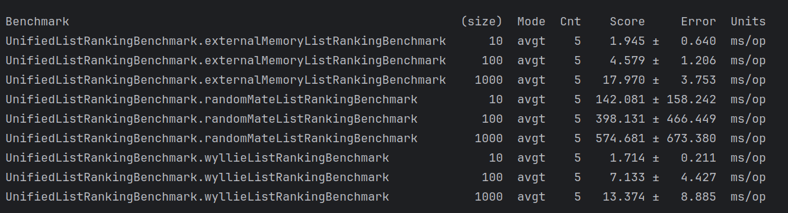
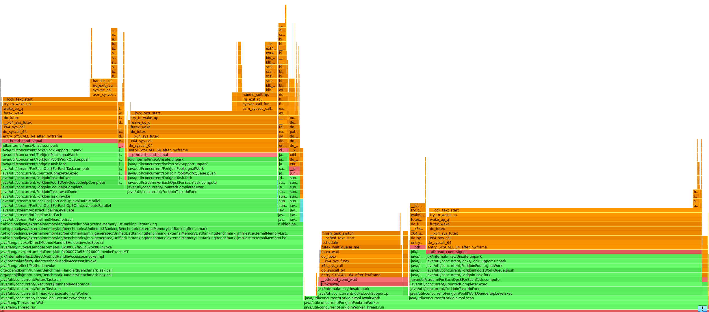
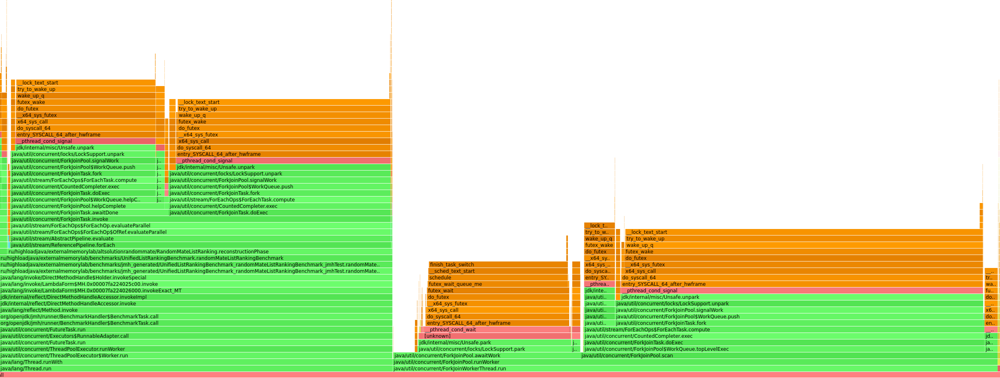
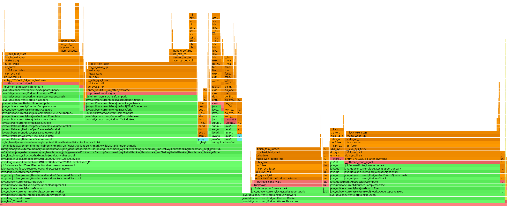
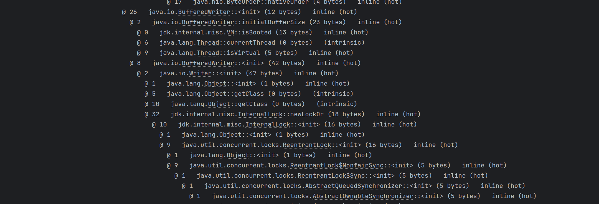
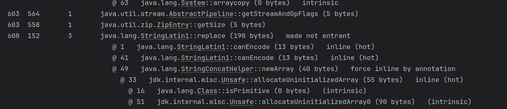
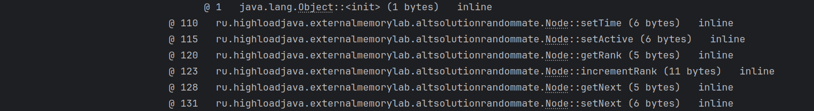
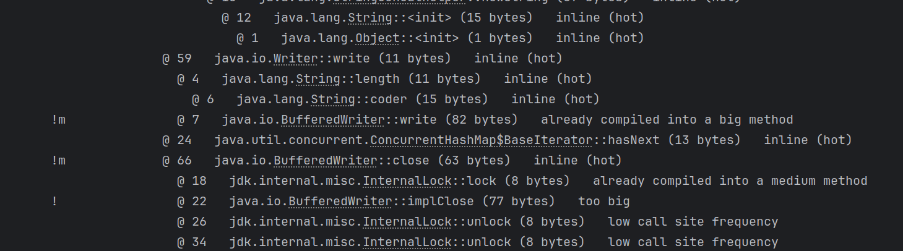
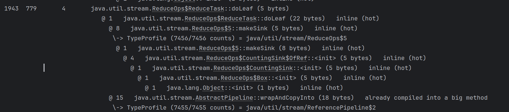

# Lab2 External Data Algorithms

В качестве задания была выбрана задача ListRanking 
(Необходимо для каждого элемента определить, каким он является по счету с конца списка. Расстояние до конца списка будем называть рангом элемента)

Для решения были написаны наивная реализация, алгоритм Wyllie 
и алгоритм рандмоизированного состояния RandomState algorithm.

Для профилирования использовался async-profiler. Для работы с файлами и потоковой обработки данных использовались Streams.

Kод основных методов в каждом из алгоритмов можно найти в соответствующем пакете. Более подробная информация находится в исходном коде.
Для каждого из алгоритмов были написаны соответвующие генераторы данных в файлы в классах 
DataGenerator, WyllieListGenerator, RandomMateListGenerator.

## Бенчмарк
Перейдем к результатам работы наших алгоритмов по времени, которые получились при помощи  JMH.

Результаты бенчмарка

Как видно из результатов наилучших результатов на наших жанных добился алгоритм Willey.

Осуществим профилирование бенчмарка и выведем flamegraph для каждого алгоритма

На flamegraph для наивной реализации видно, что происходит вызов метода listRanking, а уже над ним в стеке вызовов
параллельная обработка

Для алгоритма RandomMate на flamegraph также видно, что сначала происходит вызов метода для ранжирования списка
reconstructionPhase и уже затем потоковая обработка внутри метода

Для алгоритма Wyllie на flamegraph видно, что вызывается метод rankList, а в нем при ранжировании выполняется
потоковая обработка (свертка reduce)

Рассмотрим несколько примеров JIT компиляции нащих алгоритмов

Первым рассмотрим алгоритм с наивной релаизацией. 

На первом фрагменте видно, что в процессе выполнения 
алгоритма возникает механизм блокировки и его разрешение при помощи ReentrantLock. Это неудивительно, поскольку
мы используем многопоточную обработку при ранжировании списка

На другом фрагменте мы можем видеть механизм записи данных в некий файл

Перейдем теперь к алгоритму RandomMate

В примере показано как для данных создается копия массива

В следующем примере показан последовательный вызов методов ранжирования в методе pointerJumpingPhase

Что касается алгоритма Willey, то в данном фрагменте представлен механизм записи данных файл и использования
многопоточного ассоциативного массива concurrencyHashMap. Также видно как в конце операции снимается блокировка

Кроме того, в качестве примера продемонстрируем как в JIT представлено механизм свертки reduce при 
потоковом ранжировании списка поскольку мы используем библиотеку Streams.

